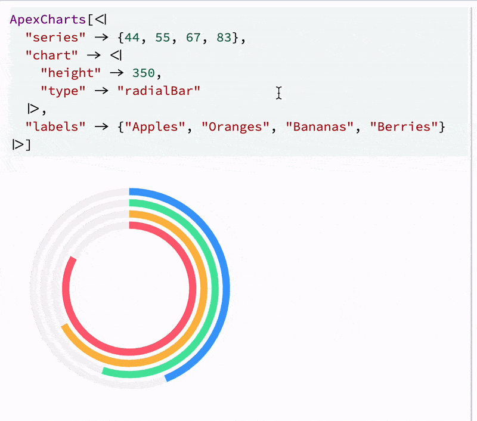

# WLJS Notebook Plugin Example 1
*Basic library functions extension with Wolfram Language and Javascript*

As an example we add here [__ApexCharts__](https://apexcharts.com/) to Wolfram Kernel



It cover the basics of

- lazy JS modules loading
- writting a basic WLJS function in Javascript with local memory
- making output forms for normal cells and slides (or WLX)
- executing Wolfram Language on browser's side

## How to install
1. Clone this repository to `<AppData>/wljs_packages` or paste github url to the settings menu
2. Restart WLJS App


## Example
Run in a new notebook

```mathematica
ApexCharts[<|
  "series" -> {44, 55, 67, 83},
  "chart" -> <|
    "height" -> 350,
    "type" -> "radialBar"
  |>,
  "labels" -> {"Apples", "Oranges", "Bananas", "Berries"}
|>]
```
